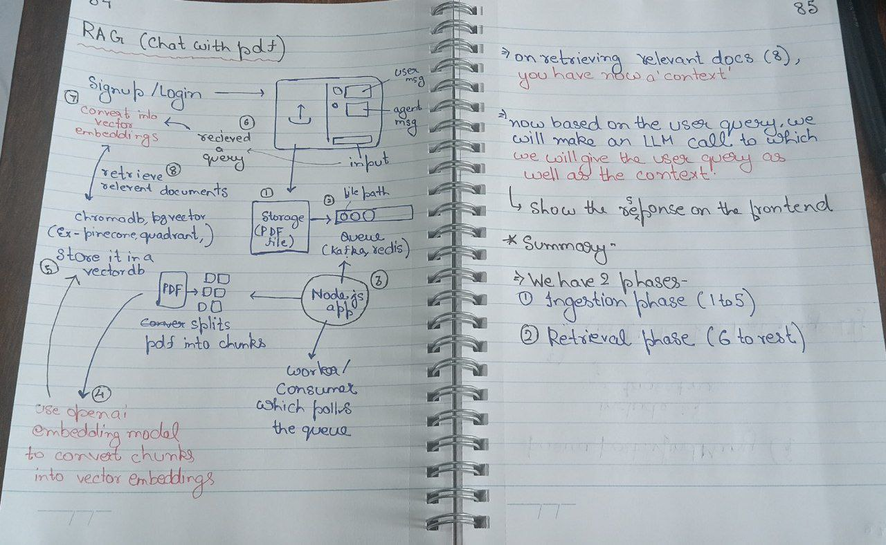

- bullmq for queues (along with valkey instead of redis)
- multer for file uploads
- clerk for authentication

---
## Valkey 
- open src key value store server
### uses
- caching (storing frequently accessed data)
- session mgmt (Storing user sessions avoiding db calls)
- realtime analytics(batch write events insteading of writing each event in db)
- message queue (with pub/sub mechanism for background job processing with real time notifications)

## Redis/Valkey vs BullMQ

* **Redis / Valkey** → **In-memory data stores** (key-value databases).

  * General-purpose: caching, pub/sub, sessions, real-time data.
  * Not a queueing system by itself, but can be used as a backend for one.

* **BullMQ** → **Job/queue library built on top of Redis**.

  * Lets you create **task queues** in Node.js.
  * Provides retries, scheduling, rate limiting, and worker management.
  * Needs Redis (or Valkey) underneath to store and coordinate jobs.

👉 In short:
**Redis/Valkey = the engine (database).**
**BullMQ = a queue manager that runs *on top of* Redis/Valkey.**
Would you like me to also show you **when to use BullMQ vs just plain Redis pub/sub**?

---
**`multipart/form-data`** is a special way of encoding data when submitting forms that include **files** (images, PDFs, videos, etc.) or large binary data.

Normally:

* `application/x-www-form-urlencoded` → sends data as simple `key=value&key2=value2` (good for text).
* `application/json` → sends data as JSON (good for APIs).

But when uploading files:

* `multipart/form-data` is used.
* The request body is split into **multiple parts**:

  * One part for each field (text input, etc.)
  * One part for each file (with its metadata: filename, content type, etc.)
* Each part is separated by a boundary string.

Example (simplified):

```
POST /upload HTTP/1.1
Content-Type: multipart/form-data; boundary=----WebKitFormBoundary123

------WebKitFormBoundary123
Content-Disposition: form-data; name="username"

Aayush
------WebKitFormBoundary123
Content-Disposition: form-data; name="pdf"; filename="file.pdf"
Content-Type: application/pdf

(binary file content here)
------WebKitFormBoundary123--
```

👉 So in short: **`multipart/form-data` is the encoding that lets browsers send both text fields and binary files together in one HTTP request.**

Would you like me to show you a small **Node.js/Express backend example** that receives such a file?
